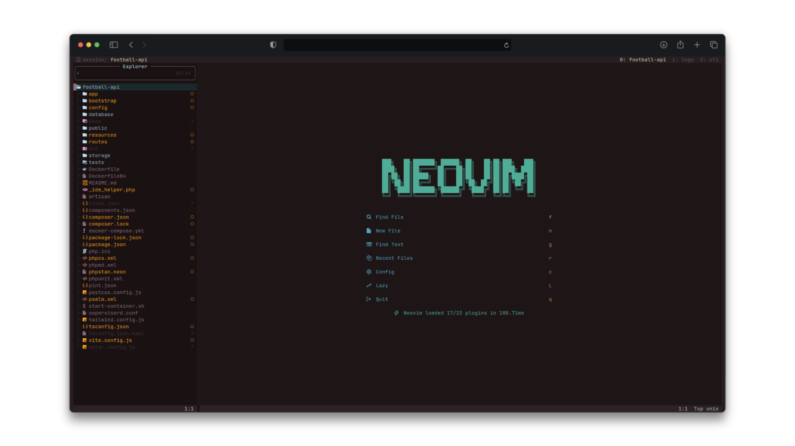
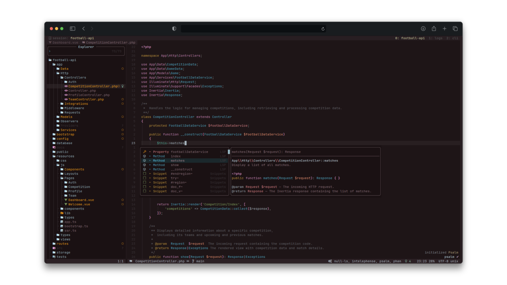

# PHP + Vue Configuration

This repository contains my personalized Neovim configuration, optimized for PHP, TypeScript, and Vue development.

## 📸 Showcase

 

---

## 📦 Installation

### Requirements

- Neovim 0.10+
- Git
- Curl
- Plugin manager (Lazy)
- Node.js (for language support)
- Composer

### Steps

```sh
# Clone this repository
git clone git@github.com:amdlemos/phpnvim.git ~/.config/phpnvim

# Start neovim
NVIM_APPNAME=phpnvim nvim"
```

---

## 🔧 Dependencies

This configuration is designed to use project-specific dependencies instead of global ones. It is recommended to install the following packages inside your project directory:


```sh
# PHP dependencies
composer require --dev squizlabs/php_codesniffer friendsofphp/php-cs-fixer phpmd/phpmd phpstan/phpstan laravel/pint vimeo/psalm phan/phan

# TypeScript/Vue dependencies
npm install --save-dev eslint typescript volar
```

### List of Dependencies:

#### PHP

| Tool           | Functionality                                                                      | Site                                                         |
| -------------- | ---------------------------------------------------------------------------------- | ------------------------------------------------------------ |
| `intelephense` | PHP Language Server Protocol (LSP) provider for better autocompletion and insights | [site](https://intelephense.com/)                            |
| `phpactor`     | PHP refactoring and completion engine                                              | [site](https://phpactor.readthedocs.io/en/master/index.html) |
| `psalm`        | Static analysis tool for finding issues in PHP code                                | [site](https://psalm.dev/)                                   |
| `phan`         | Static analyzer for PHP                                                            | [site](https://github.com/phan/phan)                         |
| `phpmd`        | Detects common PHP code issues                                                     | [site](https://phpmd.org/)                                   |
| `phpstan`      | Advanced static analysis for PHP                                                   | [site](https://phpstan.org/)                                 |
| `phpcs`        | PHP code standard enforcement                                                      | [site](https://github.com/PHPCSStandards/PHP_CodeSniffer/)   |
| `phpcbf`       | Automatically fixes PHP coding standards issues                                    | [site](https://github.com/PHPCSStandards/PHP_CodeSniffer/)   |
| `phpcsfixer`   | PHP coding style fixer                                                             | [site](https://github.com/PHP-CS-Fixer/PHP-CS-Fixer)         |
| `pint`         | Laravel Pint for PHP code formatting                                               | [site](https://laravel.com/docs/master/pint)                 |

#### TypeScript/Vue

| Tool     | Functionality                        |
| -------- | ------------------------------------ |
| `volar`  | Language server for Vue.js           |
| `ts_ls`  | TypeScript Language Server           |
| `eslint` | Linter for TypeScript and JavaScript |
| `ts_sl`  | TypeScript Solution LSP              |

---

## ⚙️ Configuration Suggestions

Here are example configurations for some of the tools:

### `phpmd.xml`

```xml

<?xml version="1.0"?>
<ruleset xmlns="https://phpmd.org/xml/ruleset/1.0.0" xmlns:xsi="http://www.w3.org/2001/XMLSchema-instance" name="My first PHPMD rule set" xsi:schemaLocation="https://phpmd.org/xml/ruleset/1.0.0                        http://phpmd.org/xml/ruleset_xml_schema_1.0.0.xsd" xsi:noNamespaceSchemaLocation="                        http://phpmd.org/xml/ruleset_xml_schema_1.0.0.xsd">
  <description>
    My custom rule set that checks my code...
  </description>
  <rule ref="rulesets/codesize.xml"/>
  <rule ref="rulesets/controversial.xml"/>
  <rule ref="rulesets/naming.xml"/>
  <rule ref="rulesets/design.xml">
    <exclude name="CouplingBetweenObjects"/>
  </rule>
  <rule ref="rulesets/cleancode.xml">
    <exclude name="StaticAccess"/>
  </rule>
  <rule ref="rulesets/unusedcode.xml">
    <exclude name="UnusedFormalParameter"/>
    <exclude name="UnusedLocalVariable"/>
  </rule>
</ruleset>
```

### `phpcs.xml`

```xml
<?xml version="1.0"?>
<ruleset name="Whitelabel">
  <description>Regras personalizadas.</description>
  <!-- Show progress of the run -->
  <arg value="p"/>
  <!-- Show sniff codes in all reports -->
  <arg value="s"/>
  <rule ref="PSR12"/>
  <rule ref="PSR12">
    <exclude name="PSR12.Operators.OperatorSpacing.NoSpaceBefore"/>
    <exclude name="PSR12.Operators.OperatorSpacing.NoSpaceAfter"/>
    <exclude name="PSR2.Classes.ClassDeclaration.OpenBraceNewLine"/>
  </rule>
  <!-- Squiz -->
  <rule ref="Squiz.Functions.MultiLineFunctionDeclaration.BraceOnSameLine">
    <severity>0</severity>
  </rule>
  <rule ref="Squiz.WhiteSpace.ScopeClosingBrace.ContentBefore">
    <severity>0</severity>
  </rule>
  <rule ref="Squiz.WhiteSpace.SuperfluousWhitespace.EndLine">
    <severity>0</severity>
  </rule>
  <!-- PEAR -->
  <rule ref="PEAR.Commenting.ClassComment.MissingAuthorTag">
    <severity>4</severity>
  </rule>
  <rule ref="PEAR.Commenting.ClassComment.MissingCategoryTag">
    <severity>4</severity>
  </rule>
  <rule ref="PEAR.Commenting.ClassComment.MissingLicenseTag">
    <severity>4</severity>
  </rule>
  <rule ref="PEAR.Commenting.ClassComment.MissingLinkTag">
    <severity>4</severity>
  </rule>
  <rule ref="PEAR.Commenting.ClassComment.Missing">
    <severity>8</severity>
  </rule>
  <!-- Generic -->
  <rule ref="Generic.Commenting.DocComment.NonParamGroup">
    <severity>4</severity>
  </rule>
  <rule ref="Generic.Commenting.DocComment.MissingShort">
    <severity>9</severity>
  </rule>
  <rule ref="PSR12.Classes.ClassInstantiation.MissingParentheses">
    <severity>0</severity>
  </rule>
<
</ruleset>
```

### `psalm`

```xml

<?xml version="1.0"?>
<psalm xmlns:xsi="http://www.w3.org/2001/XMLSchema-instance" xmlns="https://getpsalm.org/schema/config" errorLevel="6" resolveFromConfigFile="true" xsi:schemaLocation="https://getpsalm.org/schema/config vendor/vimeo/psalm/config.xsd" findUnusedBaselineEntry="true" findUnusedCode="true">
  <projectFiles>
    <directory name="app"/>
    <directory name="database/factories"/>
    <directory name="database/seeders"/>
    <ignoreFiles>
      <directory name="vendor"/>
    </ignoreFiles>
  </projectFiles>
  <issueHandlers>
    <UnusedVariable errorLevel="suppress"/>
    <UndefinedConstant errorLevel="suppress"/>
    <UndefinedMagicMethod errorLevel="suppress"/>
  </issueHandlers>
</psalm>
```

### `phan`

```php
'exclude_file_regex' => '@^vendor/.*/(tests?|Tests?)|/\.null-ls_@',
```

---

## 🔍 Tool-Specific Configurations

### PHP

- **Intelephense**: Provides LSP support for PHP with autocompletion and diagnostics.
- **Phan**: Detects issues in PHP code through static analysis.

  - Requires additional installation:
    ```sh
    pecl install ast
    ```
    More details: [php-ast](https://github.com/nikic/php-ast)
  - Recommended configuration:
    ```php
    'exclude*file_regex' => '@^vendor/.*/(tests?|Tests?)|/\.null-ls\_/@'
    ```
  - Environment variables:
    ```sh
    export PHAN_DISABLE_XDEBUG=1
    ```

- **Phpactor**: Provides code refactoring and autocompletion features.
- **Psalm**: Finds potential bugs and type issues in PHP.
- **PHPCBF**: Automatically fixes coding standard violations.
- **PHPCS**: Enforces PHP coding standards.
- **PHP-CS-Fixer**: Formats PHP code according to rules.
- **PHPMD**: Detects potential code issues.
- **PHPStan**: Provides advanced static analysis for PHP.
- **Pint**: A simple and opinionated PHP code style fixer for Laravel projects.

### TypeScript/Vue

- **Volar**: Enhances Vue development with a powerful LSP.
- **TypeScript Language Server (ts_ls)**: Provides TypeScript and JavaScript IntelliSense.
- **ESLint**: Ensures consistent code formatting and style.
- **TypeScript Solution LSP (ts_sl)**: Improves TypeScript project-wide IntelliSense.

---

## 📄 License

This project is licensed under the MIT License. See the LICENSE file for more details.
